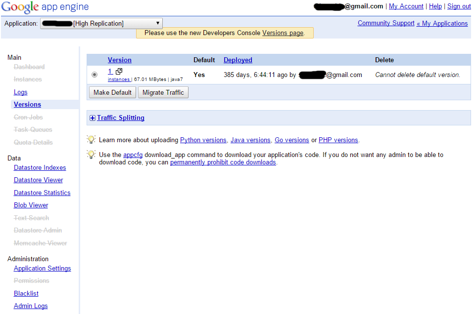

title: Migrating from Google App Engine
date: 2016-02-23 16:05:31
tags:
- node.js
- google app engine
- backend
---
As you might have read in my first [blog post](/sending-push-notifications-with-google-app-engine), I built a push notifications server on Google App Engine. It was nearly three years ago and at that point it looked nice to me to build a server in Java, deploy it on Google's service and not have to pay a cent for it. Recently a few requirements arose and while I didn't want to make the effort of whole service migration, I eventually did it. Here I'll write what were the reasons for that and how I managed to do it safe and simple.
<!--more-->

### In the beginning
There was a server, and server served users with push notifications, and server would often exceed the Google App Engine quotas. Look at [this page](https://cloud.google.com/appengine/docs/quotas), there are so many limits it's really hard to imagine which one you're gonna hit. For example, sometimes I would hit a datastore operations limit. It's set to 50,000 operations per day. Now you may think that one datastore operation is one read/write from database, and you'd be wrong. There's a table on [this page](https://cloud.google.com/appengine/pricing) which describes it in detail, but again, it was a hard time computing how many requests you can get for free. While fixing the problem and trying to minimize the database operations number I noticed a note:
> Datastore operations generated by the Datastore Admin and Datastore Viewer count against your application quota.

It means just browsing the data in the admin dashboard can make your app go out of quota limits. Not very nice, but what can you do, I understand that Google has to get the data from database for admin as well as for users. In the meantime I managed to keep the datastore operations under the quota and learned not to browse the data manually that much.

### Fear of quotas
For some time everything was fine until application got more users and hit another limit, this time 3,000 HTTP requests/minute. While it was not hard to make the app sleep for a minute when it hit the limit, now I had a real fear of quotas, looking into which one I'm going to hit next. Now you may argue that I could research the quotas better before even implementing the service, but just look at quotas and pricing pages again, it's not really possible for an app in the making to know all those numbers to compute the pricing. Another remark may be why not pay for it - simply because I didn't want to pay for something I didn't have to. The whole server was a basic thing and I rather adapted its behavior to keep it in free tier. I understood this like my pay for the work I did as a hobby project and I liked that feeling more than paying for not doing what I love to do - software development.

### The technology
Let me write a few thing about the technology on the App Engine. While in essence it was Java, Google introduced quite a few own principles in it. For example I had to use their own URL Fetch service for making a simple HTTP requests. This meant that a same thing could work OK in your local environment, but it would fail in production. Another big new thing was the [Google Query Language](https://cloud.google.com/datastore/docs/concepts/gql) (oh, the name) which not being full SQL had serious limitations. Again, as my service wasn't that much special and advanced I could adapt and use the imposed technology.

### Now what
Fast forward to one month ago and I got a requirement to implement one new API on the server. I knew something was happening with Google App Engine as the dashboard didn't look as before, some menu items were crossed over and there were notes to switch to the new dashboard. I understood there were quite a few changes and it was rebranded to Google Cloud Platform. Ok, I wasn't really interested in all the changes, I just wanted to implement the new functionality. So I tried to deploy the new version, but it simply didn't work, the tutorials written a few years ago don't work today and there are no migration guides for use old users. That did it and I decided to move away from the whole thing and implement it all from scratch and deploy it somewhere I'll have more control. 

### Node.js again
As I played with Node.js recently the decision was simple. For a service that served quite a few requests, with no internal processing needs and one which I could implement rather fast, Node.js looked like natural choice. And it was, I built a service in a few days of my free time development. I decided to deploy it on OpenShift as it provided a simple and easy to understand pricing and deployment documentation. I admit there were a few issues when something didn't work in production due to incompatible node modules, but I managed to fix them and learned about importance of versioning.

### Migration plan
I had a few options on how to migrate the data from one platform to another, but since I couldn't deploy to App Engine any more, I had to think about recreating the data first. So that's what I did, all the clients had to send its data to the new server and delete it from the old one. Luckily I implemented the delete endpoints on the old server so the users don't get the notifications from both of them. For the first week only me used the new migrated client to see if any new problem pops up. After that I released the client apps one by one to the public, driven by number of users ascending. It's now almost a week after the complete migration and all I can say is everything works and I'm happy to have the server under more control than it was on App Engine.
